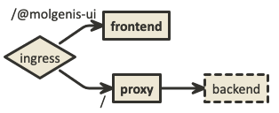

# MOLGENIS - frontend

Deploys a molgenis-frontend container in front of a proxied backend.
The incoming traffic is split by the ingresses as follows:



* `/@molgenis-ui` goes to the frontend container
* `/` goes to the backend proxy

## Customize
You can add additional proxy configurations in the ```values.yaml```. An example could be:

### Configure backend
You can configure the backend in 3 ways. You can specify the url explicitly:

```yaml
backend:
  url: https://backend.molgenis.org
```

You can define the backend by resolving the service within the deployment:

```yaml
backend:
  service: 
    enabled: true
```

You can define the backend by resolving within the kubernetes cluster:

```yaml
backend:
  service: 
    enabled: true
    targetNamespace: molgenis-master
    targetRelease: master
```

### Other proxy configuration
You can add or replace files in the `/etc/nginx/proxy.d/` dir of the container

```yaml
proxy:
  frontend:
    custom.conf: |-
      location /my-app/ {
        proxy_pass https://my-domain.ext/my-app/;
      }
```


